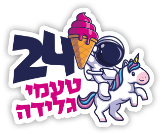

# Laptop Sticker Designs

- If you have an idea for a sticker but want/need someone else to design it - create an issue, provide the detailed description.
- If you have a design for a sticker and want to contribute it here, feel free to open a pull request

The design files made are ready for print, in vector format, CMYK colors.

### How do I receive swag?
- Print it yourself (send the files to a business producing stickers)
- Come and say hi in conferences Checkmarx attend

## Stickers
Sticker | Description 
--- | --- 
 | [Show sticker description](./stickers/its-not-a-pug/README.md)
 | [Show sticker description](./stickers/source-noder-docker/README.md)
 | [Show sticker description](./stickers/dependency-confusion/README.md)
 | [Show sticker description](./stickers/24-ice-cream/README.md)
 | [Show sticker description](./stickers/ctrl-c-v/README.md)

### License and Attribution
CC BY-NC and in addition, artworks license may change from design to design and may require attribution. Make sure to check the readme file of each art. Some designs may contain art licensed by the individual designer, therefore the artwork files in this project should be used for print purposes only
